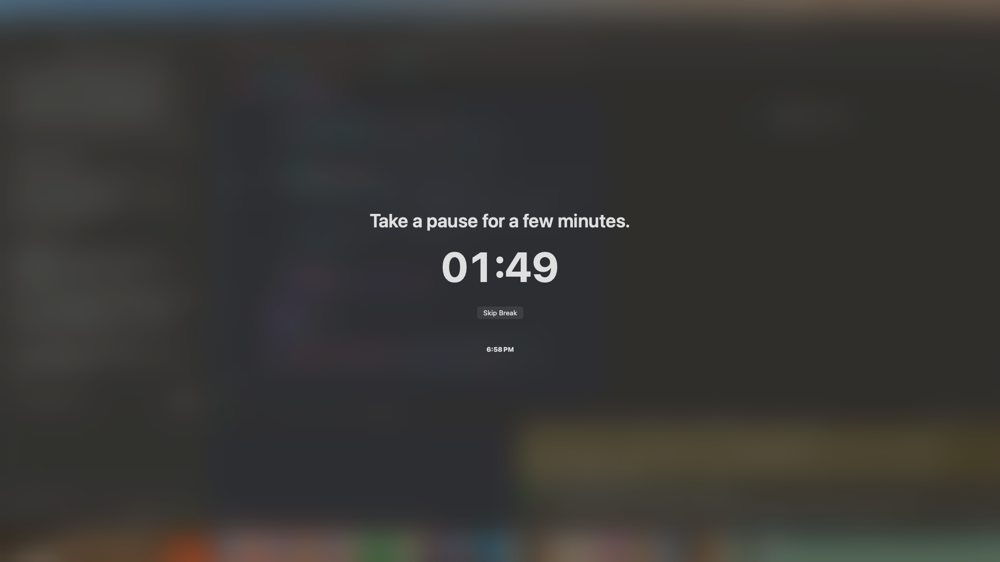

**Namidoro**

Namidoro is a simple macOS Pomodoro timer, currently a work in progress, designed to keep you focused without distractions. It sits conveniently in your menu bar and reminds you to take breaks with a full-screen break view after every 25-minute session.

Features
	•	Menu Bar Timer: Always accessible and unobtrusive while you work.
	•	Pomodoro Technique: Focus for 25 minutes, then take a full-screen break for 5 minutes.
	•	Full-Screen Breaks: Gentle reminders to rest and recharge, helping you maintain focus throughout the day.
	•	Minimal & Clean Design: Simple interface with no unnecessary clutter.

Screenshots

Installation

Instructions for building from source or installing the app.

Usage
	1.	Launch Namidoro; the timer appears in your menu bar.
	2.	Focus on work for 25 minutes.
	3.	When the session ends, a full-screen break view appears.
	4.	Repeat sessions to maintain productivity and healthy breaks.

Contributing
Contributions, suggestions, and bug reports are welcome!
